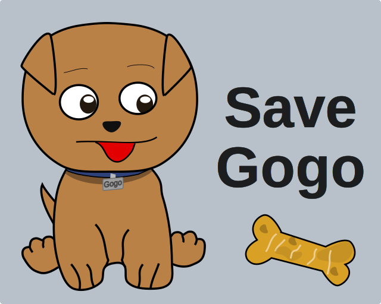

# Save Gogo

You need to help to keep Gogo alive. Every time you feed him his lifespan increases.

The mechanic is simple, you can feed Gogo by throwing the treat or pressing the feed button. You can feed him in exponential intervals, it starts at 1 hour, then 2 hours, then 4 hours... you get the picture.

His hunger meter is shown on the right side. If full, you will feed him for 60 minutes. If empty, only five seconds. Each time Gogo is fed the hunger bar decreases 6 minutes, and will only regen if no one feeds him for another 6 minutes. The hunger times are: 60m, 54m, 48m, 42m, 36m, 30m, 24m, 18m, 12m, 6m, 5s. Feeding is blocked by IP.

Now, go feed Gogo. Help keep him alive! 🐶

[https://savegogo.icy.pt/](https://savegogo.icy.pt/)

Have fun! ❤